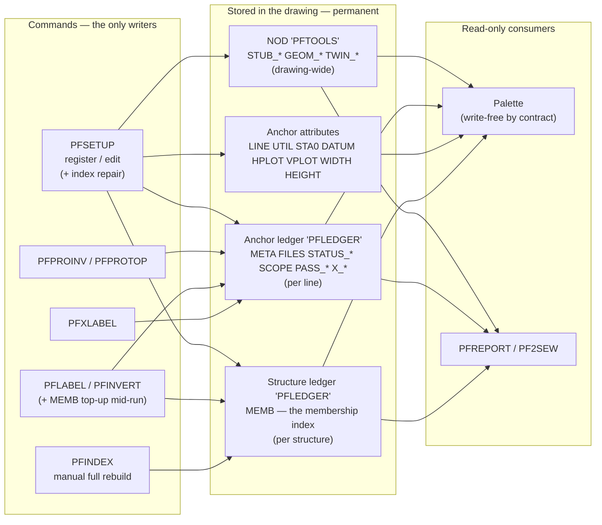

# Data flow — what is collected, when, by what, where it lands, where it shows

**Drafted 2026-07-31** as step 1 of the top-down audit; **verified against the
code and executed 2026-08-01** (the change record is
[CLOSED_ISSUES.md](CLOSED_ISSUES.md) "DATA-FLOW consolidation", gates 10–15).

- **§0–§4 are durable reference.** The picture, the storage map and the
  collection timeline should be maintained like a module README — when a
  record changes, this changes in the same edit.
- **§5–§6 are what remains open** after the 2026-08-01 sweep: two decisions
  and the CAD measurements. Everything actioned has drained to
  `CLOSED_ISSUES.md` / `OPEN-ISSUES.md` per this file's own lifecycle rule.

Static gates pass as of 2026-08-01 (parens, dupes, undefined calls, load
order, API drift; 8 dead-code notes remain, all deliberate KEEPs with in-file
justifications).

---

## 0. The picture

One rule explains the whole design: **every fact is gathered once, at the
moment it is created, and stored on the object it describes — commands write,
the palette and reports only read.**

Session memory (`*pfa-gather-memo*`, `*pfa-xscan-memo*`, `*pfa-roster*`) sits
between the stores and the readers as a per-session shortcut only — nothing
correct depends on it. `*pf-index-on*` (pftools-cfg) is the field rollback: nil
makes every MEMB read miss, so the suite falls back to computing membership
the long way rather than trusting a suspect index.

---

## 1. The storage map

Four physical stores. Everything the suite knows lives in one of them.

### 1a. NOD `"PFTOOLS"` — drawing-wide dictionary

| Key | Shape | Written by | When | Read by | Displayed |
|---|---|---|---|---|---|
| `STUB_<TYPE>_<NAME>` | `(1 .cl)(2 type)(3 name)(4 INV .pro)(5 TOP .pro)` | `pfa:stub-put` ← `pfsetup:480,571` | PFSETUP, AUTO registration | `pfa:stub-get`, `pfa:stub-list` → `pfa:registry` | **Yes** — palette tree as "Registered"; metaList Type/Line/State/Centerline |
| `GEOM_<cl-id>` | `(1 path)(300 cksum)(70 kind)(40 41 range)(10 x y sta)*` | `pfa:geom-put` ← `pf:cl-geom` (pftools-lib §5), `write-p` T only | PFSETUP registration, PFXLABEL discovery | `pfa:geom-get` — **one caller**, `pf:cl-geom` | No (internal cache) |
| `TWIN_<cl-id>` | `(1 handle)(300 cksum)` | `pfa:twin-put` ← `pfsetup:574,712` | PFSETUP | `pfa:twin-get` — **one caller**, `pfa:build-lines`. The group-300 cksum has **no reader** (its accessor is in `_attic`) | No (internal cache) |

### 1b. Extension dict `"PFLEDGER"` on the ANCHOR block

Owner-agnostic (`pfa:ledger-dict`). Legacy name `PFXLEDGER` still read, renamed
on first write.

| Key | Shape | Written by | When | Read by | Displayed |
|---|---|---|---|---|---|
| `META` | `(70 schema)(1 .cl)(301 cksum)(302 self-handle)` | `pfa:write-anchor` (initial, empty cksum), then `pfa:meta-put` ← `pfsetup:708,868`; `pfa:stamp-self` | anchor creation, PFSETUP register / re-anchor | `pfa:meta-get` — 10 sites incl. `pfa:copy-p`, `pfa:anchor->xform`, palette | **Yes** — metaList "Centerline", lvwLinkage row 1 |
| `FILES` | `(1 INV)(2 TOP)(3 exist .tin)(4 design .tin)(5 material)(300 invck)(301 topck)` | `pfa:files-put` ← `pfsetup:500,634`, `pfpro:340` | PFSETUP binding, PFPROINV/TOP | `pfa:files-get` — 9 sites | **Yes** — lvwLinkage rows 2–5, metaList "Material" |
| `STATUS_<PASS>` | `(70 state)(1 timestamp)(301 cksum)(300 finding)*` | `pfa:status-put` ← `pflabel`, `pfinvert`; `pfa:status-reset` ← PFSETUP. **Two passes only — LABEL and INVERT.** `STATUS_XING` retired 2026-08-01 (§4.1); old records ignored | **after** each pass draws | `pfa:status-roll` (state) and `pfa:status-why` (findings, STALE/FAILING only) | **Yes** — metaList "Checks" (of 2) **plus the stored findings as indented rows** (`pfp:why-rows`, 2026-08-01) |
| `SCOPE` | `(1 timestamp)(300 "sbase\|tck\|sck")*` | `pfa:scope-put` ← `pfxlabel:118` | PFXLABEL discovery | `pfa:scope-read` → `pfa:xing-scan` short-circuit | No (internal) |
| `PASS_<NAME>` | `(1 timestamp)(8 layer)(70 clayer-p)(300 handle)*` | `pfa:pass-put` ← `pflabel`, `pfinvert`, `pfxlabel` | **after** each pass draws | `pfa:pass-handles` → `pfa:erase-pass`, `pfa:pass-xs`, `pfa:teardown` | No — drives erase/recon only |
| `X_<sbase>_<sta×100>` | `(1 sfile)(2 sbase)(10 x y)(40 tsta)(41 ssta)(42 telev)(43 selev)` | `pfa:xing-merge` ← `pfxlabel`; `pfa:xing-put-elevs` ← `pfxlabel:199` | PFXLABEL discovery + label | `pfa:xing-list` — 5 sites | **Partly** — count + labeled/outstanding. Elevations 42/43 await PFCHECK (§5.1) |

### 1c. Extension dict `"PFLEDGER"` on each STRUCTURE block

| Key | Shape | Written by | When | Read by | Displayed |
|---|---|---|---|---|---|
| `MEMB` | `(10 x y)(302 roster-stamp)(300 name)(40 sta)*` | `pfa:memb-put` via **three writers**: `pfa:index-repair` ← PFSETUP (absent-only, 2026-08-01); `pfa:memb-sync` ← `pflabel:461`, `pfinvert:459` (top-up mid-run); `pfa:index-build` ← `C:PFINDEX` Build (full rebuild) | registration, labeling runs, explicit Build | `pfa:memb-get` → `pfa:lines-at` — THE read seam | No — it is the cache that makes the gather fast |

### 1d. Anchor block ATTRIBUTES (not a dictionary)

`LINE / UTIL / STA0 / DATUM / HPLOT / VPLOT / WIDTH / HEIGHT`, all invisible.
Written by `pfa:write-anchor` / `pfa:reanchor` (PFSETUP only). Read by
`pfa:read-attribs` → `pfa:anchor->xform`. **Fully displayed** in metaList
(Datum / Start sta / H plot / V plot); WIDTH/HEIGHT are consumed as geometry,
not shown. Two mechanisms on one entity is deliberate — see §4.5.

### 1e. Session memory (dies with the drawing session)

| Variable | Holds | Set by | Invalidated by |
|---|---|---|---|
| `*pfa-roster*` | current line-table stamp | `pfa:roster-set` ← `pfa:build-lines` | overwritten on next `build-lines` |
| `*pfa-gather-memo*` | `pfa:pending` results, keyed on primary + inlet-sig + lines-sig | `pfa:pend-for` | key change only; **never explicitly cleared**. Re-measure after indexing lands — see gate #11 |
| `*pfa-xscan-memo*` | `pfa:xing-scan` results | `pfa:xing-scan` (read path only) | key change only |
| `*pf-index-on*` (pftools-cfg, not per-session) | the index kill switch | hand-edit | nil = every MEMB read misses; records untouched |

---

## 2. The collection timeline — what runs when

**PFSETUP (register / edit)** — the only writer of identity and placement.
Writes `STUB_*` or the anchor block + `META` + `FILES` + `GEOM_*` + `TWIN_*`,
resets `STATUS_*` for whatever it invalidated, and **since 2026-08-01 repairs
the membership index** (`pfa:index-repair`: MEMB written where absent, stale
counted and left — see §6).

**PFPROINV / PFPROTOP** — writes `FILES` (the .pro binding and its checksum).

**PFLABEL / PFINVERT** — gather (pure read, pre-undo-group) → draw → then write
`PASS_*` and `STATUS_*`. **`MEMB` is topped up mid-run**, inside the group.

**PFXLABEL** — `pfa:xing-scan` → merge to `X_*` → `SCOPE` → draw → `PASS_XING`
+ elevations to `X_*`. Prints its freshness verdict; **stores no STATUS**
(retired 2026-08-01, §4.1).

**PFINDEX** — the explicit full rebuild/verify/report of `MEMB`; the only
command that walks every structure on purpose.

**Palette open** (`OnInitialize`) — `pfa:registry` only. Cheap: two dictionary
walks and a sort.

**Palette click, Registry tab** — `pfa:read-attribs`, `pfa:meta-get`,
`pfa:files-get`, `pfa:status-roll` + `pfa:status-why`. All dictionary reads.
Cheap.

**Palette click, Commands tab** — `pfa:target-counts`: `build-lines` +
`gather-inlets` (full modelspace `ssget`) + `pend-for` + live `status-for` /
`recon`. **Still the expensive click** until the index is populated — the
whole point of §6. `pend` is MEMB-served once records exist.

**PFREPORT / PF2SEW** — `pfa:registry` → `pfa:build-lines` once →
`pfa:gather-inlets` once → then per candidate line via **`pfa:pend-for`**
(memo-served since 2026-08-01, §4.2).

---

## 3. Executed 2026-08-01 — what changed and why (short form)

The audit's findings, in the order they were actioned. Reasoning worth keeping
lives in §4–§6; acceptance tests are CLOSED_ISSUES gates 10–15.

1. **PFINDEX wired into registration** (decided by Jake 2026-08-01) — new
   `pfa:index-repair`, called by `pfs:place-one` / `pfs:edit-one` in-group.
   Absent-only, so registration stays linear (§6).
2. **STATUS_XING retired** (§4.1) — provable duplicate of `STATUS_LABEL`.
   Roll-up now reports out of 2; `pfxl:report-status` prints, stores nothing.
3. **Stored findings surfaced** (was §3.2 "decide") — `pfa:status-why` +
   `pfp:why-rows` put the stored explanation under the Checks cell. The
   "written and never read" state was the only wrong answer; this was the
   nearly-free right one, and `Version 5.1.md` §5 Track C wanted it.
4. **PFREPORT memo bypass fixed** (§4.2) — `pfa:pend-for` replaces the direct
   `pfa:pending` call; one walk serves the run instead of one per candidate.
5. **Dead code quarantined** — 20 defuns to `pfsuite/_attic/_attic.lsp`
   (16 adjudicated + 4 cascade), never loaded, gates skip it. 8 deliberate
   KEEPs remain flagged, each with an in-file note. Details in
   CLOSED_ISSUES.md; adjudications in OPEN-ISSUES LOW-6.
6. **Crossing elevations kept** (was §3.1) — `pfa:xr-telev`/`-selev` now carry
   the PFCHECK pointer comment so no future audit re-litigates them.

---

## 4. Double duty — where one fact has more than one home

The suite's own rule is one home per fact. **The redundancy is at the FACT
level, not the store level** — see §4.5 for why the four stores are not the
problem.

### 4.0 The `.cl` checksum: five homes, each a different moment

| # | Home | Written when | Role |
|---|---|---|---|
| 1 | `META` (301) | PFSETUP registration | **the authority** |
| 2 | `GEOM_*` (300) | geometry filed | "is my cached geometry valid" |
| 3 | `SCOPE` (300) | PFXLABEL discovery | pairwise target/source agreement |
| 4 | `STATUS_LABEL` (301) | PFLABEL run | "was the .cl fresh when we labeled" |
| 5 | roster stamp, folded into **every** `MEMB` (302) | indexing | "was the line SET the same" |

These are not redundant: each records agreement at a *different moment*, which
is what makes staleness detectable at all. `pf:checksum-file` is memoised on
`(path, mtime, size)`, so recomputation is nearly free. The two genuinely
redundant homes found by the audit — the `TWIN_*` cksum (never read) and
`STATUS_XING` (exact duplicate of #4) — were removed 2026-08-01.

### 4.1 `STATUS_XING` duplicated `STATUS_LABEL` · **retired 2026-08-01**

Both read `META`, took `(301)` as `stored`, and passed the same `.cl` to
`pfa:status-check`, whose `pass` argument only builds the message string.
Identical inputs through identical code: the records could not disagree, so
the Checks cell was answering *is the `.cl` fresh* twice. There are two
distinct questions in the suite — `.cl` fresh, `.pro` fresh — and the roll-up
now counts exactly those two. (The alternative — making XING validate the
*source* `.cl`s — was rejected as a behaviour change wearing a cleanup's
clothes; `SCOPE` already owns per-source freshness.)

### 4.2 `pfreport` bypassed the memo · **fixed 2026-08-01**

`pfr:` called `pfa:pending` directly per candidate — 47 unmemoised
`inlets × lines` walks on a 47-line project. Now `pfa:pend-for`.

### 4.3 `gather-inlets` is never memoised · **open, measure first**

`(ssget "_X" '((0 . "INSERT")(410 . "Model")))` — a full modelspace scan —
runs on every `pfa:target-counts`, so every Commands-tab click rescans the
drawing. It is also the one input that can change without any pfsuite command
running, which is why it was left live. Probably not the bottleneck once MEMB
is populated; a drawing-modification-stamp guard is the candidate fix **if**
gate #11's measurement says it is needed.

### 4.4 The three `write-pass` functions · **filed low-priority**

`pflabel:write-pass` and `pfi:write-pass` are ~95% identical; one
`pfa:write-pass` taking a spec would absorb them (the third sibling,
`pfxl:write-status`, became the storage-free `pfxl:report-status` in the
STATUS_XING retirement). Filed per Jake 2026-07-31 — noted, not scheduled.

### 4.5 Why the four STORES are not the redundancy

Asked directly (Jake, 2026-08-01): consolidate to one or two data libraries.
Examined, and the answer is that **there is already one mechanism — xrecords
in dictionaries — applied at three scopes that cannot merge:**

| Scope | Holds | Why it cannot move |
|---|---|---|
| drawing-wide, keyed by `.cl` content | `GEOM_*`, `TWIN_*` | keyed by `pf:cl-id`, deliberately shared. Three lines on one `.cl` would need three copies on three anchors |
| drawing-wide, keyed by line identity | `STUB_*` | a stub has no anchor **by definition** — that is what makes it a stub |
| per-line | `META`, `FILES`, `STATUS_*`, `SCOPE`, `PASS_*`, `X_*` | — |
| per-structure | `MEMB` | one new inlet writes one record instead of invalidating the whole line's; per-structure granularity is the point (§6) |

Collapsing these makes **invalidation worse**, which is the opposite of what
consolidation is for.

**The one genuine mechanism split is on the anchor itself:** attributes and
xrecords on the same entity, reached by two read paths. Attributes stay:
`ATTDISP ON` is the documented debug escape, and `pfa:extents` uses the
**absence** of `WIDTH` to discriminate pre-icon anchors, which nothing else
can do. That is the "two at maximum" — the tree already has it, and this
paragraph is the recorded decision that used to be missing.

---

## 5. Still open — the two decisions

### 5.1 Crossing elevations — `X_*` 42/43 · **KEEP, pending PFCHECK**

Filed by `pfa:xing-put-elevs`; readers `pfa:xr-telev`/`-selev` deliberately
kept (pointer comments in place). `Version 5.1.md` §5 scopes pipe clearance as
"both elevations are already on record, subtract and compare." The reader half
was written before the consumer — that is the plan, not a bug.

### 5.2 EXACT per-vertex stations — `GEOM_*` z-slot · **Jake's call**

The one true orphan: stations are computed and stored in every drawing and no
caller reads `(nth 4 (pfa:geom-get …))`. Either name a consumer (PFCHECK is
the natural one) or stop filing them. Tracked in OPEN-ISSUES "Design
decisions"; nothing was changed pending the call.

---

## 6. The near-instant question — status after wiring

> *"We're supposed to be finding data for all the label operations on Anchor
> then storing it so that the palette lists and label processes are near
> instant."*

**The architecture is `MEMB` + `pfa:lines-at`**: expensive membership stored
per structure, self-invalidating via roster stamp + move tolerance;
`pfa:status-for` deliberately live because it describes what is drawn right
now (`STATUS_*` is the in-tree proof of why caching it would be a bug — a
validated-at-write value displayed later with no re-check).

**As of 2026-08-01 the index is populated three ways** (§1c): registration
repairs it, labeling runs top it up, `PFINDEX` Build rebuilds it. The
absent-vs-stale split is what keeps registration linear: the roster stamp
folds the whole line table, so registering line B stales every record —
repair writes only the never-indexed and leaves stale for top-up/Build. If
that proves too blunt in practice, the durable fix is the subset-roster
incremental top-up (a `*pf-index-schema*` bump) — **do not build it until
gate #11's measurement says repair-only is not enough.**

**MEASURE FIRST — CAD gate #11.** `PFINDEX` Build on a real project, then
Commands-tab click latency via `PFPDIAG`, and `PFINDEX` Verify for "same
labels, faster". Two follow-ons hang on the numbers: the `gather-inlets`
guard (§4.3) and whether `*pfa-gather-memo*` still earns its keep
(`pfa:inlet-sig` does an `entget` per inlet to build the memo key, so once
MEMB makes the walk cheap, the memo check costs a real fraction of the work
it avoids).

**Refresh stays a pure read.** Indexing from the palette would have to queue
`PFINDEX` through `pfp:defer` (write-free contract); whether a dedicated
Index control is worth an OpenDCL Studio session is an open question in
OPEN-ISSUES, deferred until after gate #11.

**What NOT to store** (unchanged, and worth keeping said): `pend` stays
derived (per-line caching invalidates worse than per-structure `MEMB`);
`status` and `drift` stay live.

---

## 7. Deferred, filed for later

- **Consolidate the diagnostic LISPs** (Jake, 2026-07-31).
  `Diagnostic_Tools/pfbad.lsp`, `pfdump.lsp`, and the ~830 lines of palette
  diagnostics in `pfpalette.lsp` §6–§7 (`PFPDIAG`, `PFPDBMOD`, `PFPPROBE`,
  `PFPREAD`, `PFPDETAIL`, `PFPNUDGE`, `PFPMOVE`, `PFPTHEME`, `PFPSCALE`) —
  28% of that file — are one tool wearing nine names. Much of §7 is the
  layout-tuning harness from the wiring phase and may simply be finished work.
- **Comment surgery** — step 4, after the above lands. The rule to agree on
  first: the `.lsp` keeps its `;; (name args) -> result` line and whatever a
  reader needs *at that line*; the README keeps the contract; decision history
  goes to `CLOSED_ISSUES.md` or is deleted. Current ratio is **1.66 lines of
  prose per line of code**, duplicated in both directions — the "why
  `pfa:xing-scan` lives in pfanchor" argument appears near-verbatim in
  `pfanchor.lsp` §5 *and* in `pfanchor/README.md`. The one-home-per-fact rule
  already covers it and is simply not being kept.
